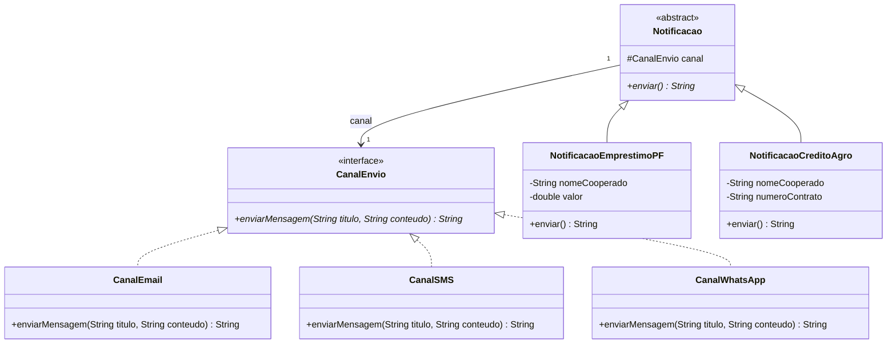

uso da bridge em uma cooperativa de crédito

diagrama:

```mermaid
classDiagram
    class Notificacao {
        <<abstract>>
        #CanalEnvio canal
        +enviar()* String
    }
    
    class CanalEnvio {
        <<interface>>
        +enviarMensagem(String titulo, String conteudo)* String
    }
    
    class NotificacaoEmprestimoPF {
        -String nomeCooperado
        -double valor
        +enviar() String
    }
    
    class NotificacaoCreditoAgro {
        -String nomeCooperado
        -String numeroContrato
        +enviar() String
    }
    
    class CanalEmail {
        +enviarMensagem(String titulo, String conteudo) String
    }
    
    class CanalSMS {
        +enviarMensagem(String titulo, String conteudo) String
    }
    
    class CanalWhatsApp {
        +enviarMensagem(String titulo, String conteudo) String
    }

    Notificacao "1" --> "1" CanalEnvio : canal
    Notificacao <|-- NotificacaoEmprestimoPF
    Notificacao <|-- NotificacaoCreditoAgro
    CanalEnvio <|.. CanalEmail
    CanalEnvio <|.. CanalSMS
    CanalEnvio <|.. CanalWhatsApp
```
